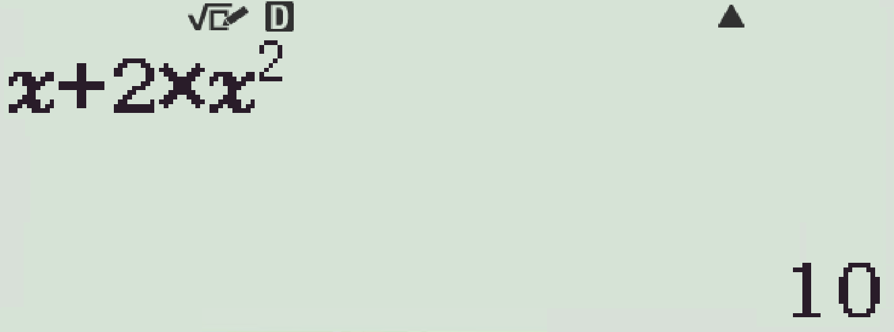
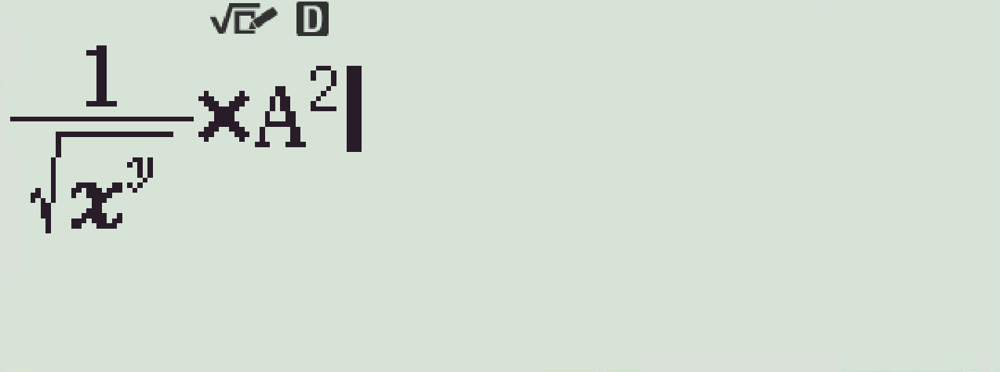
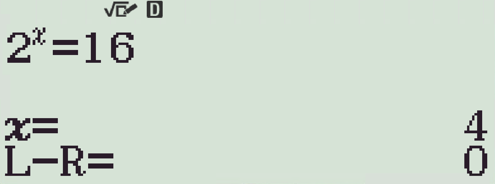
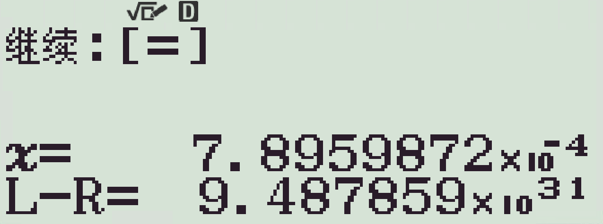

# 计算简介

> 从本章开始，我将会介绍一些用计算器计算的方法和技巧

本章内容：[#bCALC#方法](#calc方法)、[#bSOLVE#方法](#SOLVE方法)

## #bCALC#方法
#bCALC#方法 是一个能很大程度减小诸如在进行数列计算、枚举时减小修改量的方法。该方法可以在计算模式（模式1）和复数模式（模式2）中被调用。

让我们通过举例来了解这个方法的用法：

计算函数$f(x)=x+2\times x^2$，当$x$分别等于$2,3,4$时$f(x)$的值。

传统的方法可能是~~口算~~把数字一个个带进原式变成$2+2\times 2^2$、$3+2\times 3^2$、$4+2\times 4^2$再计算，但是我们的#bCALC#方法可以只输入一次表达式，之后每次定义函数自变量即可。

1. 首先把要计算的表达式原封不动的敲进计算器

2. 点击键盘左上的#bCALC#按钮

3. 在弹出的黑条中输入$2$，点击#b=#

这样我们就完成了对变量$x$的赋值，此时只需再点一次#b=#即可得到表达式答案$10$。

同样的方式可以快速给变量$x$赋值为$3$、$4$然后快速计算出相应表达式值。

如果操作足够熟练你会发现这个方法确实会给你节省很多的时间，至少不用一个一个一个的去改变量值了。

如果函数有两个自变量，操作也是类似的，下面以函数$f(x, y)=x^y$为例，我们要计算当$x=4$，$y=5$时函数的值：

1. 首先把要计算的表达式原封不动的敲进计算器

2. 点击键盘左上的#bCALC#按钮

此时你可能注意到了液晶屏右上出现了一个下箭头:fa fa-caret-down:的图标，这意味着我们可以通过按键盘上的上下键来切换将要赋值的变量。 
我们先对变量$x$进行赋值，顺次按下#b4##b=#（将$x$赋值为$4$） 
此时变量$x$值已经为$4$，我们需要切换到变量$y$进行赋值。

你可能注意到了点击了#b=#后计算器自动切换到了$y=$的界面，我们只需要正常的赋值即可。 
如果前一个数字赋值错了，我们可以点上下键来切换回上一个变量再次赋值。

?> 当开始编辑一个变量的值后，计算器会进入“线性编辑”模式（你能看到屏幕上有光标在闪烁且无黑条），除非 按#b=#完成变量的赋值 或 按#bAC#放弃编辑 从而退出该模式，否则无法切换变量。 

“线性编辑”模式内使用线性语法而非数学语法，比如$3^2$应输入为`3^(2`

## 应用

!> 所有例题**严禁动笔计算**！

1. 请计算函数$f(x, y, z)=\frac{1}{\sqrt{x^y}}\times z^2$，$x=3$，$y=4$，$z=5$时的值
2. 求出函数$f(x)=\frac{x}{\sqrt{x^x}}$，$x\in \left\{1, 4, 6\right\}$的值域。
3. 求出函数$f(a)=a^2 + 4a + 6$当$a$取值为$114$，$514$，$1919$时函数的值。

### 解析
1. 这个主要是想让大家练一下多变量赋值，你完全可以把自变量带进去变成$\frac{1}{\sqrt{3^4}}\times 5^2$敲出答案的，不过我们还是用#bCALC#方法试一遍。 先把算式敲进去，由于计算器中没有变量$z$，故用其他的变量（比如这里我用的是$A$）代替。

顺次按下#bCALC##b3##b=#（将$x$赋值为$3$）#b4##b=#（将$y$赋值为$4$）#b5##b=#（将$A$赋值为$5$）#b=#（得出结果$\frac{25}9$）

2. 通过定义域求值域，定义域就三个数，一个自变量重复使用了3此，很适合使用#bCALC#减少修改表达式时间。 输入表达式后顺次按下#bCALC##b1##b=#（将$x$赋值为$1$）#b=#（得出结果$\frac{\sqrt{3}}3$），#bCALC##b4##b=#（将$x$赋值为$4$）#b=#（得出结果$\frac14$），#bCALC##b6##b=#（将$x$赋值为$6$）#b=#（得出结果$\frac1{36}$）。 所以函数值域为$\left\{\frac{\sqrt{3}}3, \frac14, \frac1{36}\right\}$

3. 这题比较有气味，也比较容易，那就权且作为一个打字练习，直接给答案：$f(114)=13458$，$f(514)=266258$，$f(1919)=3690243$。

## #bSOLVE#方法

#bSOLVE#方法 是一个很好用也很不好用的方程求解工具，拿他用来求一元一解方程还是很方便的，但由于自身算法的局限性可能会一定程度上误导用户。具体原理及问题请见[#bSOLVE#方法的局限性及应对方法](#solve方法的局限性及应对方法)

#bSOLVE#方法仅能在计算模式（模式1）中被调用。

使用#bSOLVE#方法解方程很简单，直接在计算器中敲入你要解的方程，这里以方程$2^x=16$为例：

1. 直接输入方程。

2. 顺次按下#bSHIFT##bCALC#（即为#bSOLVE#）

3. 按下#b=#，等待片刻即可得到答案

这里的输出分为三个部分：最顶上的原方程，下面的近似解（“$x=$”）与误差（“$L-R=$”）。

正常情况下误差一般为0，当然有些难缠的方程例如$x^{\log_2^x}=\frac{\sqrt{2}}2$就会出现类似下图的中间步骤：

我的评价是：一般出现这种样子大概率计算器是算不出来解了，你的方程对于这个计算器过于复杂了，可以试着进行简化（比如指化对，如果可以的话）或者从[#bSOLVE#方法的局限性及应对方法](#solve方法的局限性及应对方法)中寻找解决方法。

### #bSOLVE#方法的局限性及应对方法

### 牛顿法概述

了解一个算法的用途最好的方法就是了解他的原理，下面这段看得懂就看，看不懂直接跳。

官方说明文档中说过#bSOLVE#方法使用的是牛顿法。

牛顿法又称牛顿迭代法，是信息学中求方程根的重要方法之一，这里以计算一元方程为例（fx-991CN X 仅能计算一元方程）：

对目标一元函数在$x_0$点处进行泰勒展开，可得：
$$
f(x) = f(x_0) + f'(x_0)(x-x_0) + \frac12 f''(x_0)(x-x_0)^2+\cdots+\frac1{n!}f^{(n)}(x_0)(x-x_0)^n
$$

忽略$2$次以上的项，可得：
$$
f(x) = f(x_0) + f'(x_0)(x-x_0) + \frac12 f''(x_0)(x-x_0)^2
$$

现在我们以$x0$为基准，要找到导数为0的点。对上面等式两边同时求导，并令导数为0，可得：
$$
f'(x) = f'(x_0) + f''(x_0)(x-x_0) = 0
$$

整理一下可得：
$$
x = x_0 - \frac{f'(x_0)}{f''(x_0)}
$$

看到这里大多数的同学应该都理解了，我们只要重复执行上面的这个方程就能得到一个略微精确的方程的解，即：
$$
x_{t+1} = x_t - \frac{f'(x_0)}{f''(x_0)}
$$

“迭代”就是这个方法的精髓，计算器只需要反复不停的执行上面这个方程，反复更新$x$的值，最后就能得到一个近似解。

### 牛顿法的局限性

### 牛顿法局限性的应对方法

## 应用

!> 所有例题**严禁动笔计算**！

### 解析