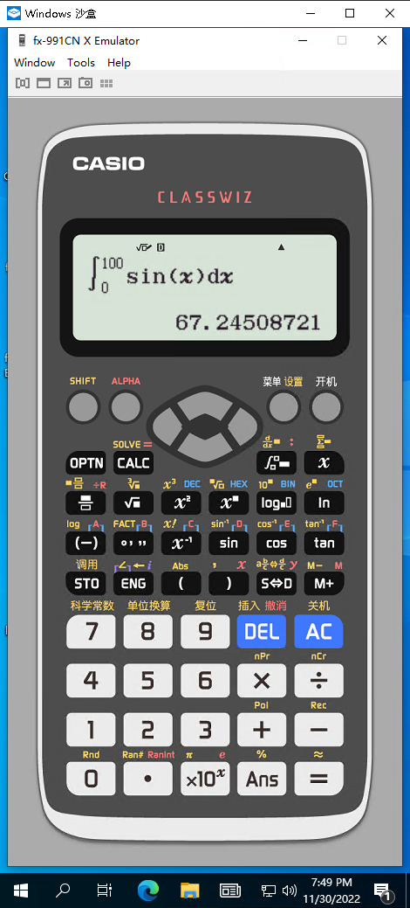

# fx-991CN X 简明使用说明

> 本项目是针对全体上海市高中生的一份计算器（fx-991 CN X）使用的简单手册，致力于帮助更多同学更好的压榨手中计算器的功能。
> 
> 如果各位有其他的hack方法欢迎提交issue或Pull Request。
>
> 所有出现的操作名、按键名、图标等全部优先使用卡西欧用户说明书中的称呼，后使用习惯称呼。

!> 本文仅摘录对于学习用途使用计算器有用的方法，不会接受如卡花屏、卡119模式等的操作方法。但会摘录部分对于解除花屏有效的行为。

## 本项目中的书写格式

### 操作表示
按下按键XXX：<span class="btn">XXX</span>

同时按下按键XXX与YYY：<span class="btn">XXX</span>+<span class="btn">YYY</span>

顺次按下按键XXX与YYY：<span class="btn">XXX</span><span class="btn">YYY</span> 或 <span class="btn">XXX</span>、<span class="btn">YYY</span>

## Quick Start 快速部署

?> 请确保您所使用的设备中已配置好可用的`Node.js`、`npm`与`git`

```bash
$ npm i docsify-cli -g
$ git clone git@github.com:Howardzhangdqs/fx-991CN-X-Usage.git
$ cd fx-991CN-X-Usage
$ docsify s ./docs -p 3000
```

打开[localhost:3000](http://localhost:3000/)即可阅读

## TODO
未来可能排版为$\LaTeX$，具体做不做看工期和我心情

## Other 其他
本项目根目录处放置了一个[电脑端 fx-991CN X 模拟器](https://github.com/Howardzhangdqs/fx-991CN-X-Usage/blob/main/fx-991CN%20X%20Emulator19.exe.tar)

!> **此模拟器为盗版，安全性未知！**如需使用建议下载后放入不重要的虚拟机或沙箱中删掉文件后缀名中的`.tar`后双击运行。如有安全可靠的模拟器破解版欢迎联系。

较为稳妥的使用方法：

