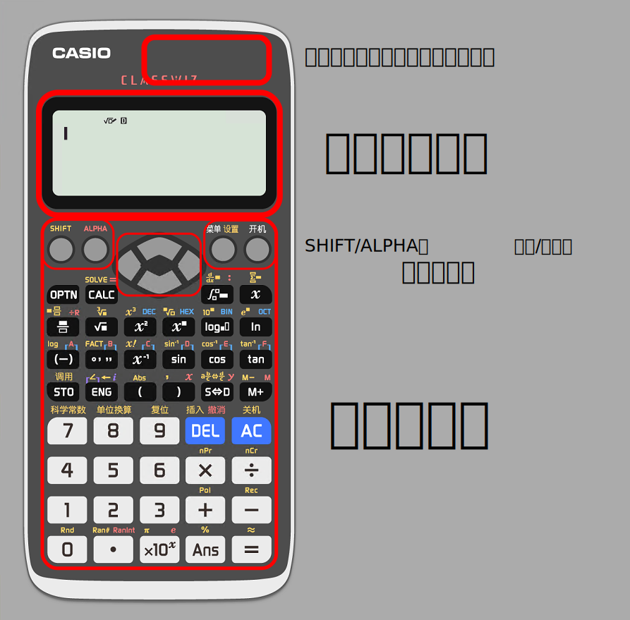

# 计算器概述

一台优秀的、健康的、刚到货的fx-991CN X应该长成这样：

如果你的计算器不长这样，~~那说明你的计算器不够健康~~那说明你的计算器买错了，具体可以看计算器右上角的型号

!> 没有fx-991CN X的同学请一定要购买一台，不要买得力的，不要买fx-350，不要买fx-CG50，只能买fx-991CN X！

为增强观赏效果，绝大多数操作都将会用模拟器代替实机演示。

?> 模拟器下载请见 [fx-991CN X 简明使用说明 - Other 其他](introduction?id=other-%e5%85%b6%e4%bb%96)

## 计算器可见区域组成

我画这张图主要是因为在用了一年计算器后，我班里一同学突然指着顶上的太阳能板问我这是干啥的，当时我是震惊的。

计算器主要日常供电使用的是电池，只有在电池不够时或太阳能较好时才会使用太阳能供电。太阳能供电时计算器液晶显示屏右上角会有一个太阳:fa fa-sun-o:的标志